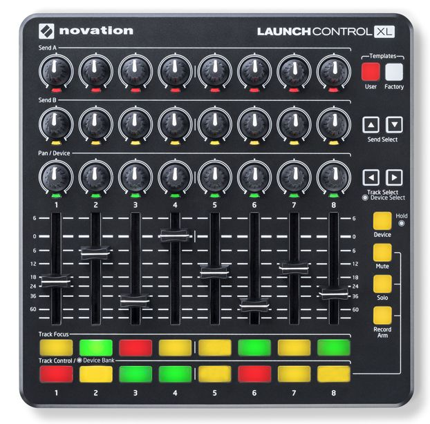

# Readme



Launch control XL Streamlabs OBS controller.

This is a basic vanilla JS project to link a midi controller with Streamlabs OBS to control various parameters.

To configure this project, rename `secrets.default.js` to `secrets.js` and fill out the variables. Read [here](https://github.com/stream-labs/streamlabs-obs-api-docs#how-to-connect-web-application-to-streamlabs-obs) on how to enable Streamlabs API and retrieve the token.

`device` is the name of the device as displayed in Windows. This is usually `Launch Control XL`, but could change.

Launch control must be in `User` template.

## Macros

The script has a few methods to change various parameters of SLOBS. Each method is accessed via the `obsApp` variable.

The script first calls `midiApp.connect()` which connects to the midi device, and then connects to the OBS API. After the API is connected, `initMacros` is called to initialise the macros.

Macros should be setup in `initMacros`. In `script.js` there are examples of macro buttons such as scene switching, device muting, source hiding. Additionally, there are examples of macros for faderes such as volume control and source scaling, and examples of pot controlls such as source position and crop.

Macros are added to the `midiMap.macro` map with an associated key identifier.

Macros follow the following model:

```js
{
	id: <ANY>, // can be anything, use as reference for object in callback
	note: <INT>, // the trigger note. `matrix` contains a map for a Launch Control XL
	toggle: <BOOL>, // If the note is a toggle
	toggled: <BOOL>, // If the note is toggled
	fader: <BOOL>, // If the note is a fader
	pot: <BOOL>, // If the note is a potentiometer
	choke: <INT>, // For buttons, deactivate any other macro on the same choke value first before callback
	colour: <COLOURS>, // Use Colours constant
	callback: <function(velocity)> // Function callback. Passes velocity as parameter
}
```

## API

Accessed via `obsApp`

| Function name | parameters | description |
|---------------|------------|-------------|
| setScene | Scene ID (scene.id) | Sets the current scene |
| setVolume | Source ID (source.sourceId), Value (0.0 - 1.0) | Sets the volume of a given source ID. Percentage value from 0.0-1.0 |
| setMuted | Source ID (source.sourceId), Muted (boolean yes/no) | Sets the source ID as muted or unmuted |
| setVisible | Source ID (source.sourceId), Visible (boolean yes/no) | Sets the source ID as visible or invisiblle |
| updateTransformation | Source | Sets the transformation for the source. `source.transform` must exist. |
| rotateSource | Source, Velocity | Sets the rotation of the source mapped by midi value 0-127 |
| flipSourceX | Source, Velocity | Flips the source along the X axis for values < 54 and > 74. Crossing value 64 resets the trigger | 
| flipSourceY | Source, Velocity | Flips the source along the Y axis for values < 54 and > 74. Crossing value 64 resets the trigger  | 

Helper methods 

| Function name | parameters | description |
|---------------|------------|-------------|
| findScene | name | Finds a scene from a name |
| findNode | name | Finds a node from a name |
| findSource | name | Finds a source from a name |


## MIDI Matrix

A basic midi matrix is mapped via the `matrix` const.

The array maps a standard Launch Control XL.

From top to bottom:

- Send A pots
- Send B pots
- Pan / Device pots
- Faders
- Track focus buttons
- Track control buttons
- Mute, Solo, Record arm buttons (respective)

## Known issues

- Adding/modifying scenes or devices via Streamlabs OBS client will require a refresh of the html page to re-load the configuration and information.
- Rotating sources does not maintain position

